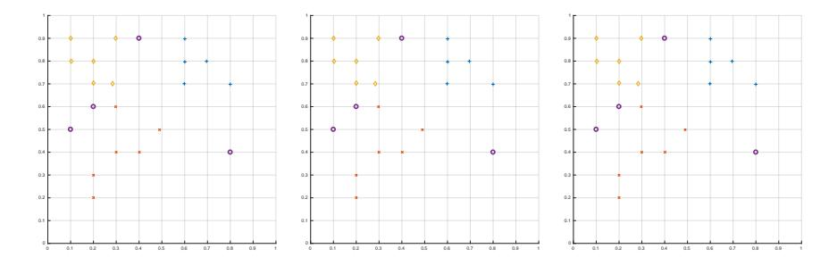

# Machine Learning 2017/2018

## Example 2

Question 1. (5 points) Graphically show how classification of the unknown instances, depicted as circles, is performed based on the K-nearest neighbors algorithm for K = 1, 3 and 5. Textually describe how K-NN works, just designing the result is not sufficient.

Question 2. (5 points) Briefly describe the main parts that form a single convolutional layer and their function.

Question 3. (5 points) Describe how Principle Components are identified based on the principle of variance maximization.

### Question 4. (5 points)

A car driver in Rome has to move from one side of the Tiber river to the other every morning. There are three possible alternative paths passing to three different bridges and the paths are known. The driver wants to minimize the time to reach the target location, and due to traffic conditions, it is not guaranteed that the shortest path is also the quickest way. Moreover, traffic conditions are unpredictable and non-deterministic, but stationary.

1. Describe a complete model for this problem based on MDP, specifying all its elements.

- 2. Describe how to solve the problem based on Reinforcement Learning and determine the exact training rule to use to learn the best behavior.
- 3. Discuss the strategy for balancing exploration and exploitation in this case.

#### Question 5. (5 points)

Confusion matrices are used to summarize the result of a classification algorithm.

- 1. Provide a formal definition of a confusion matrix.
- 2. Provide an example (with invented numbers) of a confusion matrix for a classification problem for the target function f : {0, 1} 4 → {Low, Medium, High} and a data set containing 150 samples (of which 70 for Low, 30 for Medium and 50 for High).
- 3. Describe how to compute classification accuracy, given a confusion matrix.

### Question 6. (5 points)

Consider a data set D for scoring different schools with the following realvalued attributes: staff salaries per pupil (x1), teacher's test score (x2), parents' education (x3), school grade (y).

For this problem, an expert of the domain proposes to use the following model.

$$y = \theta_1 x_1 + \theta_2 x_2 + \theta_3 x_3 + \theta_4 x_1 x_2 + \theta_5 x_3^2$$

- 1. Define an error function for this model.
- 2. Discuss if a linear model for regression can be used in this case.
- 3. Describe an iterative approach to solve the problem.