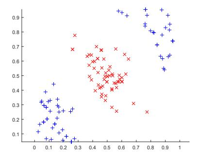
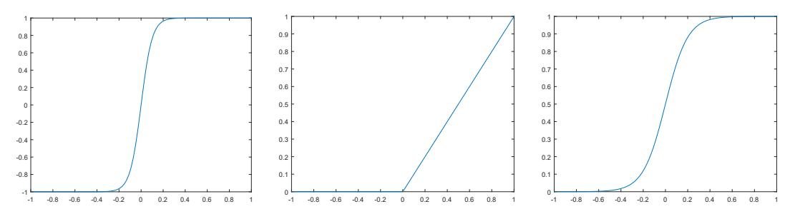
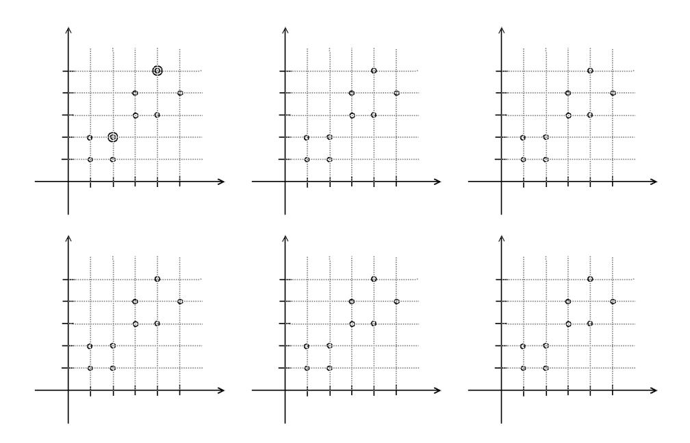

# Machine Learning 2017/2018

### 13/12/2017

Question 1. (5 points) The following data have been collected and we want to learn the general concept *Acceptable*, by using Decision Tree Learning.

| House | Furniture | Nr rooms | New kitchen | Acceptable |
|-------|-----------|----------|-------------|------------|
| 1     | No        | 3        | Yes         | Yes        |
| 2     | Yes       | 3        | No          | No         |
| 3     | No        | 4        | No          | Yes        |
| 4     | No        | 3        | No          | No         |
| 5     | Yes       | 4        | No          | Yes        |

- 1. Formalize the learning problem.
- 2. Describe how variables are chosen when building a Decision Tree.
- 3. Execute the ID3 algorithm on the data set above and generate the corresponding output tree.

Note: point 3 can be answered even if point 2 is not properly addressed, by using any invented method (or invented numbers) for the selection of the variables.

#### Question 2. (5 points)

- 1. What is a maximum likelihood (ML) hypothesis?
- 2. Comment the following statement: in a classification problem, the class returned by the ML hypothesis on a new instance x is always the most probable class.

Question 3. (5 points) Consider classification of the data shown in the figure below by using SVMs.

- 1. Explain which kernel function you would choose to obtain perfect separability.
- 2. How SVMs classification can be applied if the data are note perfectly separable?

Question 4. (5 points) Let x ∈ X = {(1.8, 2.1)T ,(3.2, 1.4)T ,(2.5, 4.1)T , (1.6, 7.7)T ,(3.1, 9.1)T } and t ∈ T = {0, 1, 1, 0, 1}. Consider designing an artificial neural network for learning the function t = f(x, θ).

- 1. Explain what is a suitable activation function for the output layer of the network.
- 2. For the selected activation function explain if the output units saturate and how learning the parameters of the network is affected if this is the case.

## Question 5. (5 points)

- 1. Consider an image of wim × him elements (pixels) and a convolution kernel of dimension 3 × 3 × 16. What are the possible values of the stride and padding in order to convolve without skipping any pixels, while obtaining a feature map with the same dimensions with the input image.
- 2. Associate the correct name of the activation function to the plots above and provide the corresponding mathematical definition. The list of names is {*ReLU, Sigmoid, Hyperbolic Tangent*}.

#### Question 6. (5 points)

Simulate the execution of K-means in this 2-D data set with k=2 and initial centroids indicated by double circles: use one diagram for each step of the algorithm. Describe explicitly how each step is obtained and what is the termination condition of the algorithm. Drawing only the steps is not sufficient.

