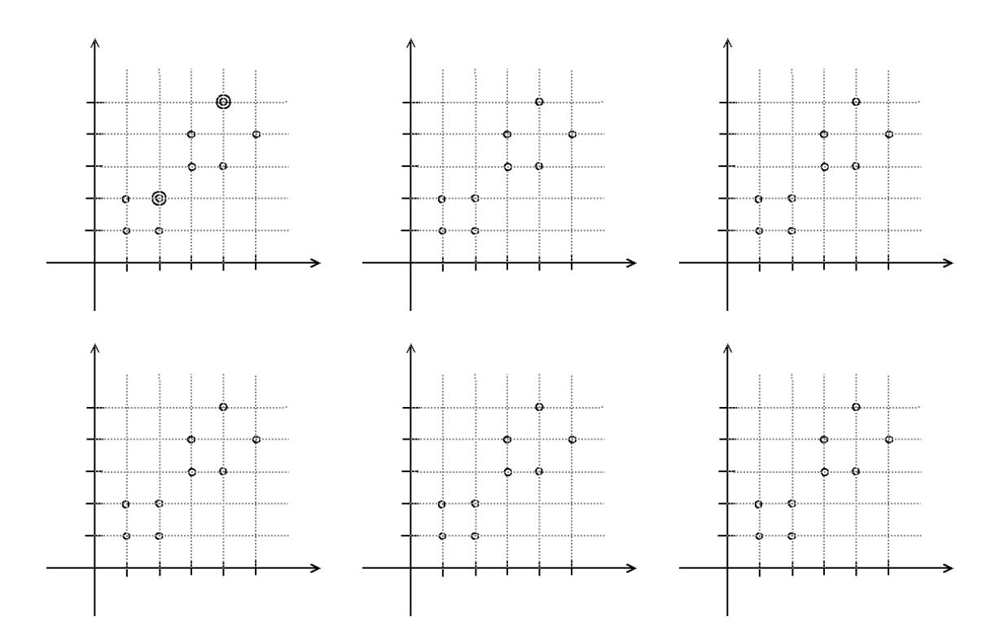

# Machine Learning – Test - December 20, 2018

Time limit: 2 hours.

| Last Name | First Name                                                                                        | Matricola                                                                                      |
|-----------|---------------------------------------------------------------------------------------------------|------------------------------------------------------------------------------------------------|
|           |                                                                                                   |                                                                                                |
|           |                                                                                                   |                                                                                                |
| Note:     | (when you were supposed to attend the course). Please specify also if you are an Erasmus student. | if you are not doing the exam for ML 2018/19, write below name of exam, CFU, and academic year |
|           |                                                                                                   |                                                                                                |

# EXERCISE 1

Given input values xi and the corresponding target values ti with i = 1, . . . , N, the solution of regularized linear regression can be written as:

$$y(\mathbf{x}) = \sum_{i}^{N} \alpha_{i} \mathbf{x}_{i}^{T} \mathbf{x},$$

with α = (XXT + λI) −1 t, X = [x1, . . . , xN ] T and λ the regularization weight.

Considering a kernel function k(x, x 0 ):

- 1. Provide a definition of the Gram matrix.
- 2. Explain how a kernelized version for regression can be obtained based on the equations provided above.

#### EXERCISE 2

Consider a two-layers ANN which receives in input vectors x of dimension 128 and produces output vectors y of dimension 10. The hidden layer of the ANN is composed of 50 units which use the ReLU activation function. The output units use a linear activation function.

- The weight matrices of the hidden and output layers are denoted W1 and W2. Provide the dimensions of the weight matrices W1 and W2
- Provide the formula explicitly stating how the values of y are computed given an input vector x in terms of the weight matrices and the activation functions (you can ignore the bias terms).

## EXERCISE 3

Briefly describe what is the architecture of an autoencoder and its purpose.

### EXERCISE 4

Simulate the execution of K-means in this 2-D data set with k=2 and initial centroids indicated by double circles: use one diagram for each step of the algorithm. Describe explicitly how each step is obtained and what is the termination condition of the algorithm. Drawing only the steps is not sufficient.

# EXERCISE 5

- 1. Provide the main steps of classification based on K-nearest neighbors (K-NN).
- 2. Draw an example in 2D demonstrating the application of the 3-NN algorithm for the classification of 3 points given a dataset consisting of points from 4 different classes.

Notes: You can choose how the points of the 4 classes are distributed. Use a different symbol for each class (e.g. use (\*,x,+,-) for the classes and (o) for the points to be classified).

# EXERCISE 6

Assume you have 4 image classifiers with medium-good classification accuracy.

- 1. Describe an ensemble method for achieving higher classification accuracy by combining such classifiers.
- 2. Are there any specific properties that each classifier has to have to achieve higher accuracy? If the answer is positive, explain which these properties are.