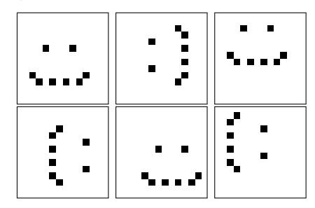

# Machine Learning – January 19, 2018

Time limit: 2 hours.

|       | Last Name                                     | First Name                                                                                 | Matricola |
|-------|-----------------------------------------------|--------------------------------------------------------------------------------------------|-----------|
|       |                                               |                                                                                            |           |
| Note: | (when you were supposed to attend the course) | if you are not doing the exam ML 2017/18, write below name of exam, CFU, and academic year |           |
|       |                                               |                                                                                            |           |

- EXERCISE 0 (points [0, 1] mulitplied to the overall score of the test)
- 1. Write your name and matricola code in each paper you deliver.
- 2. Write all the answers of exercises A on one sheet marked as A, and all the answers of exercises B on another sheet marked as B. Do not mix answers of exercises A and B on the same sheet.
- 3. Do not use text books, slides, notes, mobile phone, laptop, etc.

### EXERCISE A1

Consider a CNN with the following structure for its first two layers:

conv1 5 × 5 kernel and 64 feature maps with padding 2 and stride 1

relu1 acting on 'conv1'

pool1 2 × 2 max pooling with stride 2 acting on 'relu1'

conv2 3 × 3 kernel and 128 feature maps with padding 0 and stride 2

relu2 acting on 'conv2'

pool2 2 × 2 max pooling with stride 4 acting on 'relu2'

- 1. For input images of dimension 1242 × 378 × 3 compute the dimensions of the volume on the output of each layer and explain how it is computed.
- 2. Describe what is the number of parameters of each layer.

#### EXERCISE A2

Consider the binary (black & white) images below defined on a 12 × 12 grid:

- 1. Explain what is the dimensionality of the data space and what is the intrinsic dimensionality of the given data.
- 2. Suppose you apply PCA on the data x1, . . . , x6 and find that the data can be fully described using M principal components, namely u1, . . . , uM. Describe how the original data can be written in the space defined by these M principal components.
- 3. Is M going to be equal to the number of intrinsic dimensions? Explain.

# EXERCISE A3

Consider the following energy-like function defining Support Vector Machine regression:

$$J(\mathbf{w}, C) = C \sum_{i=1}^{N} L_{\epsilon}(t_i, y_i) + \frac{1}{2} ||\mathbf{w}||^2,$$

with yi , ti target and predicted values, respectively, and L(t, y)= 0 if |t−y|< |t−y|− otherwise the -insensitive error function.

- 1. Plot the -insensitive error function and explain what is the difficulty in minimizing J.
- 2. To overcome this difficulty slack variables ξ + and ξ − are introduced. Explain (qualitatively) the role of the slack variables.

# EXERCISE B1

Briefly describe a linear classification method and discuss its performance in presence of outliers. Use a graphical example to illustrate the concept.

# EXERCISE B2

In Bayesian Learning, given a data set D and a hypothesis h, we can express the following relationship between the probability distributions (Bayes theorem):

$$P(h|D) = \frac{P(D|h)P(h)}{P(D)}$$

In this context:

- 1. define Maximum a posteriori (MAP) hypotheses and Maximum likelihood (ML) hypotheses.
- 2. define the concept of Bayes Optimal Classifier
- 3. discuss about practical applcability of the Bayes Optimal Classifier

# EXERCISE B3

Describe the Markov property of Markovian models representing dynamic systems. Describe the difference between a Markov Decision Process (MDP) and a Hidden Markov Model (HMM). Draw and explain the graphical models of MDP and HMM.