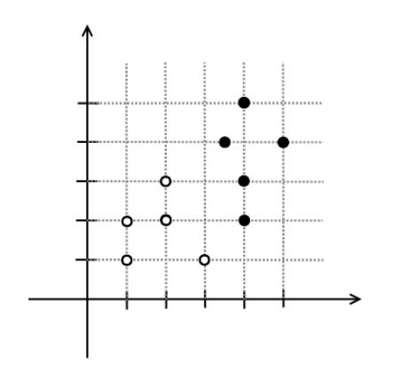
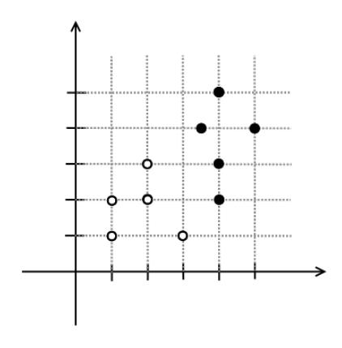
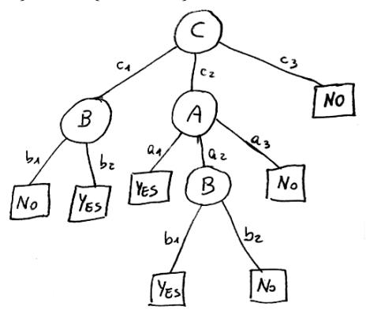

# Machine Learning – February 12, 2018

Time limit: 2 hours.

| Last Name | First Name | Matricola                                                                                                                                                                                       |
|-----------|------------|-------------------------------------------------------------------------------------------------------------------------------------------------------------------------------------------------|
|           |            |                                                                                                                                                                                                 |
| Note:     |            | if you are not doing the exam ML 2017/18, write below name of exam, CFU, and academic year (when you were supposed to attend the course). Please specify also if you are an Erasmus student. |
|           |            |                                                                                                                                                                                                 |

EXERCISE 0 (points [0, 1] mulitplied to the overall score of the test)

- 1. Write your name and matricola code in each paper you deliver.
- 2. Write all the answers of exercises A on one sheet marked as A, and all the answers of exercises B on another sheet marked as B. Do not mix answers of exercises A and B on the same sheet.
- 3. Do not use text books, slides, notes, mobile phone, laptop, etc.

### EXERCISE A1

Machine learning problems can be categorized in supervised and unsupervised. Explain the difference between them providing a precise formal definition (not only explanatory text) in terms of input and output of the two categories of problems.

### EXERCISE A2

Consider the following data set for binary classification, where the two classes are represented with white and black circles. Draw in each of the diagrams a possible solution for a method based on Perceptron with very small learning rate and a method based on SVM. Describe the difference between the two solutions and explain how these are obtained with the two methods. Discuss which solution would you prefer and why.

# EXERCISE A3

Given a classification problem for the function f : A × B × C → {Y ES, NO}, with A = {a1, a2, a3}, B = {b1, b2}, C = {c1, c2, c3} and the following decision tree T that is the result of training on a given data set:

- 1. Provide a rule based representation of the tree T.
- 2. Determine if the tree T is consistent with the following set of samples

$$S \equiv \{s_1 = \langle a_1, b_1, c_1, NO \rangle, s_2 = \langle a_2, b_1, c_2, YES \rangle, s_3 = \langle a_1, b_2, c_3, NO \rangle, s_4 = \langle a_3, b_2, c_1, YES \rangle\}.$$

Motivate your answer.

#### EXERCISE B1

- 1. Provide the main features about boosting.
- 2. Write the error function whose minimization leads to a formulation equivalent to the AdaBoost algorithm.

## EXERCISE B2

Consider the problem of finding a function which describes how the salary of a person (in hundreds of euros) depens on his/her age (in years), the months in higher education and average grades in higher education. A dataset in the form D = {(x T 1 , t1), . . . ,(x T N , tN )} is provided, with x ∈ R 3 denoting the input values and t the target values (salary).

Assuming that one tries to identify this function with a deep feed-forward network:

- 1. Explain how the problem is formalized by writing the parametric form of the function to be learned highlighting the parameters θ.
- 2. Explain what are suitable choices for the activation functions of the hidden and output units of the network.
- 3. Explain what is a suitable choice for the loss function used for training the network and write the corresponding mathematical expression.

# EXERCISE B3

Given input values xi and the corresponding target values ti with i = 1, . . . , N, the solution of regularized linear regression can be written as:

$$y(\mathbf{x}) = \sum_{i}^{N} \alpha_{i} \mathbf{x}_{i}^{T} \mathbf{x},$$

with α = (XXT + λI) −1 t, X = [x1, . . . , xN ] T and λ the regularization weight.

Considering a kernel function k(x, x 0 ):

- 1. Provide a definition of the Gram matrix.
- 2. Explain how a kernelized version for regression can be obtained based on the equations provided above.