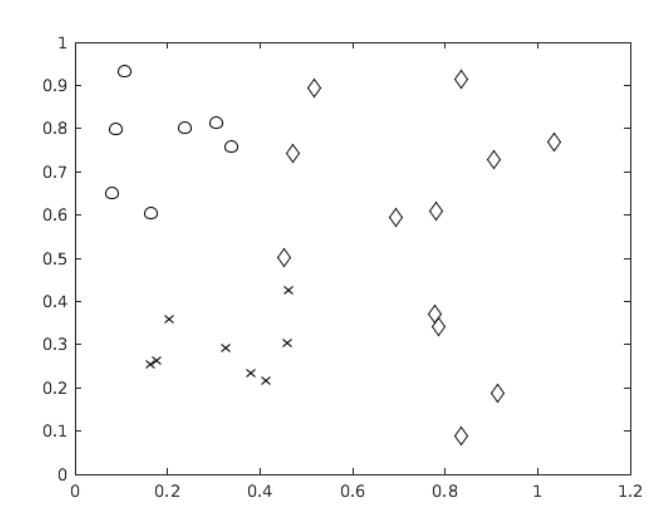
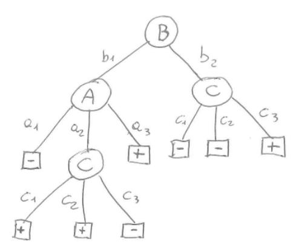

# Machine Learning – January 18, 2019 - B

Time limit: 2 hours.

| Last Name | First Name                                                                                            | Matricola                                                                                      |
|-----------|-------------------------------------------------------------------------------------------------------|------------------------------------------------------------------------------------------------|
|           |                                                                                                       |                                                                                                |
|           |                                                                                                       |                                                                                                |
| Note:     | (when you were supposed to attend the course). Please specify also if you are an Erasmus student.  | if you are not doing the exam for ML 2018/19, write below name of exam, CFU, and academic year |
|           |                                                                                                       |                                                                                                |

# EXERCISE 1

Consider the data shown in the figure below:

Considering classification based on support vector machines (SVMs):

- 1. Explain if the data are separable and motivate your answer (only 'yes' or 'no' are not acceptable answers).
- 2. Explain what type of kernel function you would use in this case.
- 3. Describe what are the possible solutions for applying SVMs for classification of multiple classes.

## EXERCISE 2

- 1. Describe the perceptron model for classification and its training rule.
- 2. Draw a graphical representation of a 2D data set for binary classification and provide a qualitative graphical example of a possible evolution of perceptron training (4 images showing a possible temporal evolution of the solution of the algorithm on the sketched data set).

## EXERCISE 3

Consider a regression problem for the target function f : < 6 → <6 . Design a solution based on Artificial Neural Network for this problem: draw a layout of a suitable ANN for this problem and discuss the choices.

- 1. Determine the size of the ANN model (i.e., the number of unknown parameters).
- 2. Is Backpropagation algorithm affected by local minima? If so, how can we avoid or attenuate it?
- 3. Is Backpropagation algorithm affected by overfitting? If so, how can we avoid or attenuate it?

### EXERCISE 4

- 1. Briefly describe the goal of linear regression and define the corresponding model.
- 2. Given a dataset D = {(x1, t1), . . . ,(xN , tN )} with xn the input values and tn the corresponding target values, explain how the parameters of the model can be estimated either in a batch or in a sequential mode.

### EXERCISE 5

In Bayesian Learning, given a data set D and a hypothesis h, we can express the following relationship between the probability distributions (Bayes theorem):

$$P(h|D) = \frac{P(D|h)P(h)}{P(D)}$$

In this context:

- 1. define Maximum a posteriori (MAP) hypotheses and Maximum likelihood (ML) hypotheses.
- 2. define the concept of Naive Bayes Classifier
- 3. discuss about practical applcability of the Naive Bayes Classifier

# EXERCISE 6

Given a classification problem for the function f : A × B × C → {+, −}, with A = {a1, a2, a3}, B = {b1, b2}, C = {c1, c2, c3} and the following decision tree T that is the result of a learning algorithm on a given data set:

- 1. Provide a rule based representation of the tree T.
- 2. Determine if the tree T is consistent with the following set of samples S ≡ {s1 = ha1, b1, c1, −i, s2 = ha2, b1, c2, +i, s3 = ha1, b2, c3, +i, s4 = ha2, b2, c2, +i}. Show all the passages needed to get to the answer.