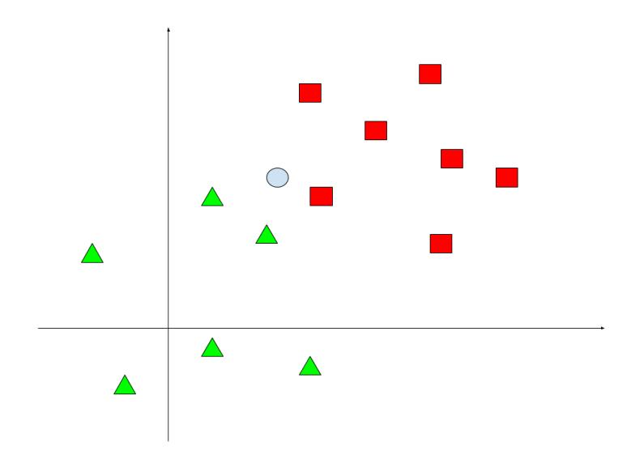

# Machine Learning – February 12, 2019 - A

Time limit: 2 hours.

| Last Name                                                                                                  | First Name | Matricola                                                                                      |
|------------------------------------------------------------------------------------------------------------|------------|------------------------------------------------------------------------------------------------|
|                                                                                                            |            |                                                                                                |
| Note: (when you were supposed to attend the course). Please specify also if you are an Erasmus student. |            | if you are not doing the exam for ML 2018/19, write below name of exam, CFU, and academic year |
|                                                                                                            |            |                                                                                                |

# EXERCISE 1

- 1. Provide a formal definition of the Reinforcement Learning (RL) problem. Describe formally what are the inputs and the outputs of a RL algorithm.
- 2. Describe the main steps of a RL algorithm. Provide an abstract pseudo-code of a generic algorithm for RL (e.g., Q-learning).

# EXERCISE 2

Describe two different methods to overcome overfitting in Convolutional Neural Networks (CNN).

## EXERCISE 3

- 1. Describe the principle of maximal margin used by SVM classifiers. Illustrate the concept with a geometric example.
- 2. Draw a linearly separable dataset for binary classification of 2D samples. Draw two solutions (i.e., two separation lines): one corresponding to the maximum margin, the other one can be any other solution.
- 3. Discuss why the maximum margin solution is preferred for the classification problem.

## EXERCISE 4

- 1. Provide the definition of Confusion matrix for a multi-class classification problem.
- 2. Provide a numerical example of a confusion matrix for a 3-classes classification problem with a balanced data set including 100 samples for each class. Show the confusion matrix in two formats: with absolute values and with the corresponding percentage values.
- 3. Compute the accuracy of the classifier for the numerical example provided above.

Hint: use simple numerical values, so that you do not need to make complex calculations.

#### EXERCISE 5

Given an unsupervised dataset D = {xn}

- 1. Define the Gassian Mixture Model (GMM) and describe the parameters of the model.
- 2. Draw an example of a 2D data set (i.e., D ⊂ <2 ) generated by a GMM with K = 3, qualitatively showing in the picture also the parameters of the model.
- 3. Determine the size of the model (i.e., number of independent parameters) for the dataset illustrated above.

#### EXERCISE 6

- 1. Describe the K-nearest neighbors (K-NN) algorithm for classification.
- 2. Given the dataset below for the two classes {square, triangle}, determine the answers of K-NN for the query point indicated with symbol o for K=1, K=3, and K=5. Motivate your answer, showing (with a graphical drawing) which instances contribute to the solution.

