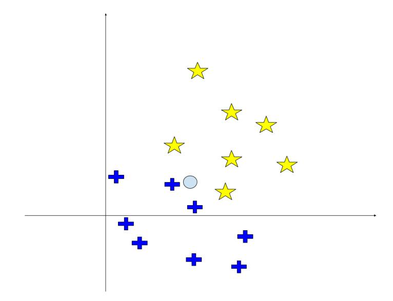

# Machine Learning – February 12, 2019 - B

Time limit: 2 hours.

| Last Name | First Name                                                                                        | Matricola                                                                                      |
|-----------|---------------------------------------------------------------------------------------------------|------------------------------------------------------------------------------------------------|
|           |                                                                                                   |                                                                                                |
|           |                                                                                                   |                                                                                                |
|           |                                                                                                   |                                                                                                |
| Note:     |                                                                                                   | if you are not doing the exam for ML 2018/19, write below name of exam, CFU, and academic year |
|           | (when you were supposed to attend the course). Please specify also if you are an Erasmus student. |                                                                                                |
|           |                                                                                                   |                                                                                                |
|           |                                                                                                   |                                                                                                |
|           |                                                                                                   |                                                                                                |

## EXERCISE 1

- 1. Describe the principle of maximal margin used by SVM classifiers. Illustrate the concept with a geometric example.
- 2. Draw a linearly separable dataset for binary classification of 2D samples. Draw two solutions (i.e., two separation lines): one corresponding to the maximum margin, the other one can be any other solution.
- 3. Discuss why the maximum margin solution is preferred for the classification problem.

# EXERCISE 2

Given an unsupervised dataset D = {xn}

- 1. Define the Gassian Mixture Model (GMM) and describe the parameters of the model.
- 2. Draw an example of a 2D data set (i.e., D ⊂ <2 ) generated by a GMM with K = 3, qualitatively showing in the picture also the parameters of the model.
- 3. Determine the size of the model (i.e., number of independent parameters) for the dataset illustrated above.

## EXERCISE 3

- 1. Discuss the following statement: "Accuracy is not always a good performance metric for classification".
- 2. Provide a numerical example to motivate your answer.

#### EXERCISE 4

Describe the typical stages of a single Convolutional layer in Convolutional Neural Networks (CNN).

#### EXERCISE 5

- 1. Describe the difference between exploitation and exploration in reinforcement learning and discuss why it is important to properly balance between the two strategies.
- 2. Describe how exploitation and exploration are generally implemented in RL algorithms. Illustrate this step with an abstract pseudo-code.

#### EXERCISE 6

- 1. Describe the K-nearest neighbors (K-NN) algorithm for classification.
- 2. Given the dataset below for the two classes {star, plus}, determine the answer of K-NN for the query point indicated with symbol o for K=1, K=3, and K=5. Motivate your answer, showing (with a graphical drawing) which instances contribute to the solution.

