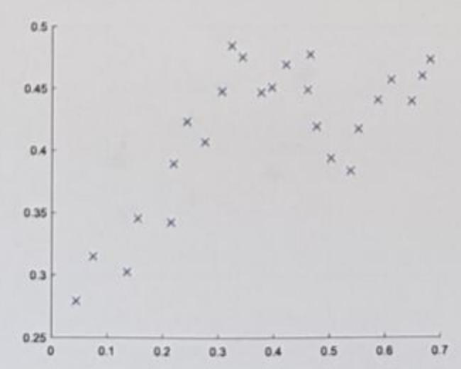
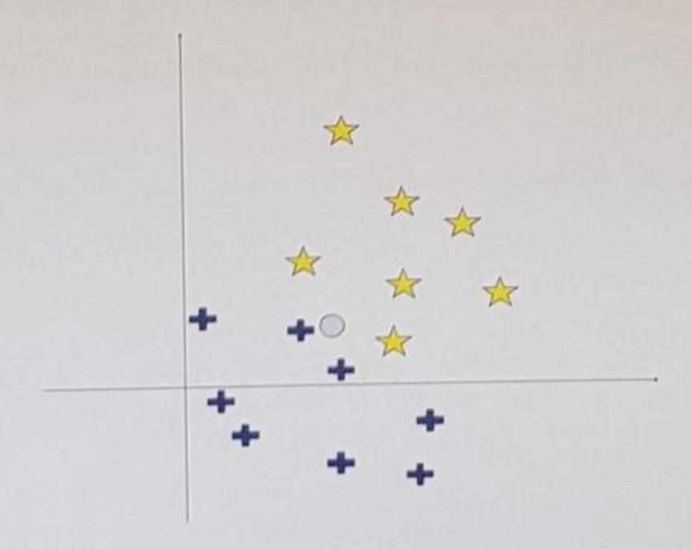

# Machine Learning - October 15, 2019

Time limit: 2 hours.

| Last Name | First Name                                                                   | Matricola                                                        |
|-----------|------------------------------------------------------------------------------|------------------------------------------------------------------|
|           |                                                                              |                                                                  |
|           | exam for ML 2018/19, write below no the course). Please specify also if y | name of exam, CFU, and academic year you are an Erasmus student. |
|           |                                                                              |                                                                  |

### EXERCISE 1

- 1. Provide the definition of Confusion matrix for a multi-class classification problem.
- 2. Provide a numerical example of a confusion matrix for a 3-classes classification problem with a balanced data set including 100 samples for each class (300 samples in total). Show the confusion matrix in two formats: with absolute values and with the corresponding percentage values.
- 3. Compute the accuracy of the classifier for the numerical example provided above.

Hint: use simple numerical values, so that you do not need to make complex calculations.

#### **EXERCISE 2**

Consider the learning problem of estimating the function  $f: \Re \mapsto \Re$  with dataset  $D = \{(x_i, y_i)\}$  plotted in the figure below:

- Describe how to perform regression based on these data using a method of your choice. Specifically, provide a mathematical formulation of the model, highlighting the model parameters.
- Considering the method you have chosen describe a way to reduce overfitting.
- Draw a plausible plot of the learned model based on your choices.

## EXERCISE 3

- Describe the perceptron model for classification.
- 2. Describe the perceptron training algorithm.
- 3. Discuss convergence properties of percepton training algorithm.

# **EXERCISE 4**

- 1. Qualitatively explain the maximum margin principle on which Linear SVM classification is based.
- Draw an example of a 2-D binary classification problem showing: i) a generic margin separating points belonging to two different classes, and ii) the margin identified by Linear SVM.

## EXERCISE 5

- 1. Describe the K-nearest neighbors (K-NN) algorithm for classification.
- Given the dataset below for the two classes {star, plus}, determine the answer of K-NN for the query point indicated with symbol o for K=1, K=3, and K=5. Motivate your answer, showing (with a graphical drawing) which instances contribute to the solution.

#### EXERCISE 6

- Describe the general approach of boosting.
- Assume you have an image classifier with low classification accuracy. Provide the main steps for achieving higher classification accuracy by combining multiple instances of the classifier.