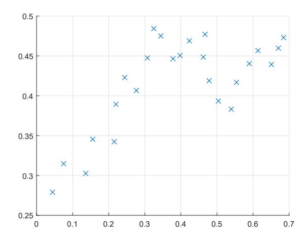

# Machine Learning – Test - November 4, 2019

Time limit: 2 hours.

| Last Name                                                                         | First Name | Matricola                                                                                                                             |  |
|-----------------------------------------------------------------------------------|------------|---------------------------------------------------------------------------------------------------------------------------------------|--|
|                                                                                   |            |                                                                                                                                       |  |
|                                                                                   |            |                                                                                                                                       |  |
| Note: academic year (when you were supposed to attend the course). student. |            | if you are not doing the regular exam for ML 2019/20, write below name of exam, CFU, and Please specify also if you are an Erasmus |  |
|                                                                                   |            |                                                                                                                                       |  |
|                                                                                   |            |                                                                                                                                       |  |

#### EXERCISE 1

The following data have been collected and we want to learn the general concept Acceptable, by using Decision Tree Learning.

| House | Furniture | Nr rooms | New kitchen | Acceptable |
|-------|-----------|----------|-------------|------------|
| 1     | No        | 3        | Yes         | Yes        |
| 2     | Yes       | 3        | No          | No         |
| 3     | No        | 4        | No          | Yes        |
| 4     | No        | 3        | No          | No         |
| 5     | Yes       | 4        | No          | Yes        |

- 1. Formalize the learning problem: decribe exactly the target function to learn and the dataset.
- 2. Describe qualitatively how attributes are chosen when building a Decision Tree.
- 3. Simulate the execution of ID3 algorithm on the data set above and generate the corresponding output tree.

Note: point 3 can be answered even if point 2 is not properly addressed, by using any invented method (or invented numbers) for the selection of the variables.

### EXERCISE 2

- 1. Provide a formal definition of a maximum likelihood (ML) hypothesis
- 2. Comment the following statement: in a classification problem, the class returned by the ML hypothesis on a new instance x is always the most probable class.

### EXERCISE 3

Briefly describe a linear classification method and discuss its performance in presence of outliers. Use a graphical example to illustrate the concept.

## EXERCISE 4

Given input values xi and the corresponding target values ti with i = 1, . . . , N, the solution of regularized linear regression can be written as:

$$y(\mathbf{x}) = \sum_{i}^{N} \alpha_{i} \mathbf{x}_{i}^{T} \mathbf{x},$$

with α = (XXT + λI) −1 t, X = [x1, . . . , xN ] T and λ the regularization weight.

Considering a kernel function k(x, x 0 ):

- 1. Provide a definition of the Gram matrix.
- 2. Explain how a kernelized version for regression can be obtained based on the equations provided above.

#### EXERCISE 5

Consider the learning problem of estimating the function f : < 7→ < with dataset D = {(xi , yi)} plotted in the figure below:

- 1. Describe how to perform regression based on these data using a method of your choice. Specifically, provide a mathematical formulation of the model, highlighting the model parameters.
- 2. Considering the method you have chosen describe a way to reduce overfitting.
- 3. Draw a plausible plot of the learned model based on your choices.

# EXERCISE 6

- 1. Provide the main steps of classification based on K-nearest neighbors (K-NN).
- 2. Draw an example for a 4-classes classification problem in 2D. Use symbols (\*,x,+,-) for the four classes. Graphically show the application of the K-NN algorithm with K = 3 for the classification of 3 different query points.