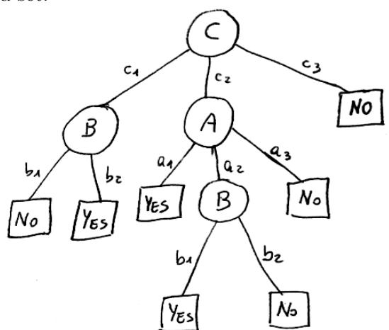
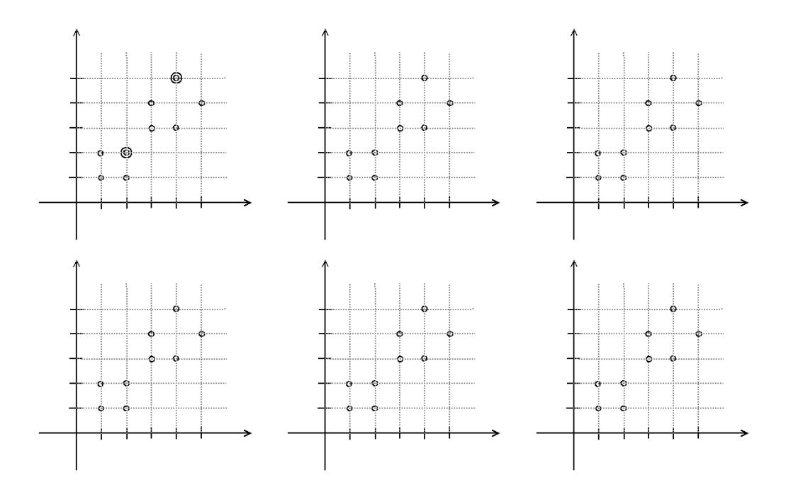

# Machine Learning – Exam - December 16, 2019

Time limit: 2 hours.

Last Name First Name Matricola ...................................................... ...................................................... ......................................................

Note: if you are not doing the regular exam for ML 2019/20, write below name of exam, CFU, and academic year (when you were supposed to attend the course). Please specify also if you are an Erasmus student.

.......................................................................................................................................................................

# EXERCISE 1

Given a classification problem for the function f : A × B × C → {+, −}, with A = {a1, a2, a3}, B = {b1, b2}, C = {c1, c2, c3} and the following decision tree T that is the result of a learning algorithm on a given data set:

- 1. Provide a rule based representation of the tree T.
- 2. Determine if the tree T is consistent with the following set of samples S ≡ {s1 = ha1, b1, c1, Noi, s2 = ha2, b1, c2, Y esi, s3 = ha1, b2, c3, Y esi, s4 = ha2, b2, c2, Y esi}. Show all the passages needed to get to the answer.

## EXERCISE 2

In Bayesian Learning, given a data set D and a hypothesis h, we can express the following relationship between the probability distributions (Bayes theorem):

$$P(h|D) = \frac{P(D|h)P(h)}{P(D)}$$

In this context:

- 1. define Maximum a posteriori (MAP) hypotheses and Maximum likelihood (ML) hypotheses.
- 2. define the concept of Bayes Optimal Classifier
- 3. discuss about practical applcability of the Bayes Optimal Classifier

## EXERCISE 3

- 1. Describe the perceptron model for classification and its training rule.
- 2. Draw a graphical representation of a 2D data set for binary classification and provide a qualitative graphical example of a possible evolution of perceptron training (4 images showing a possible temporal evolution of the solution of the algorithm on the sketched data set, with the last image showing a possible final solution).

# EXERCISE 4

Consider a two-layers ANN which receives in input vectors x of dimension 128 and produces output vectors y of dimension 10. The hidden layer of the ANN is composed of 50 units which use the ReLU activation function. The output units use a linear activation function. The weight matrices of the hidden and output layers are denoted W1 and W2, respectively.

- 1. Provide the dimensions of the weight matrices W1 and W2
- 2. Provide the formula explicitly stating how the values of y are computed given an input vector x in terms of the weight matrices and the activation functions (you can ignore the bias terms).

#### EXERCISE 5

Simulate the execution of K-means in this 2-D data set with k=2 and initial centroids indicated by double circles: use one diagram for each step of the algorithm. Describe explicitly how each step is obtained and what is the termination condition of the algorithm. Drawing only the steps is not sufficient.

## EXERCISE 6

- 1. Briefly describe what is the architecture of an autoencoder and its purpose.
- 2. Draw an example of autoencoder.