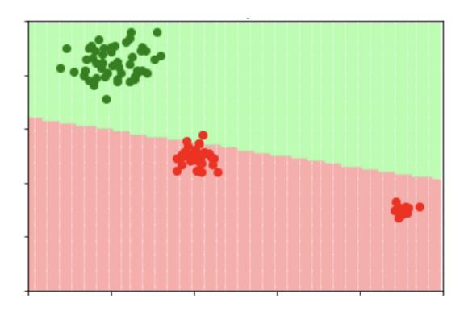

# Machine Learning – January 19, 2021

Time limit: 2 hours 15 minutes.

# EXERCISE 1

Consider the following dataset, containing samples of a function f:

| x1  | x2 | x3 | f   |
|-----|----|----|-----|
| 0.6 | 3  | 1  | 4.6 |
| 1   | 2  | 3  | 2.1 |
| 4   | 4  | 1  | 10  |

- 1. Assume you want to estimate f. What problem are we dealing with? Provide the mathematical formulation of a model that could be used for this problem.
- 2. Illustrate an algorithmic technique that can be used to train the chosen model.

## EXERCISE 2

Consider the following dataset (with red and green classes).

- 1. Is this dataset linearly separable? Explain your answer.
- 2. Which approach could reasonably produce the shown boundary?
- 3. Which approach would you expect NOT to produce the separation boundary shown in the figure? Why?

### EXERCISE 3

Consider binary classification (classes: + and −):

- 1. Show an example consisting of a classifier and a simple dataset where the accuracy metric fails to correctly quantify the classifier quality.
- 2. Discuss whether more reliable metrics exist and provide the details.

## EXERCISE 4

- 1. Give a short explanation of the Kernel trick (kernel substitution). What is the necessary condition for applying the kernel trick? What is a kernel?
- 2. Consider a linear model for binary classification, i.e. y(x; w) = wT x, without regularization. Provide an example of applying the kernel trick on this problem. In detail:
  - provide the mathematical formulation of the model before applying the kernel trick;
  - explain why it is possible to apply the kernel trick;
  - provide the "kernelized" formulation of the model.

#### EXERCISE 5

Consider designing an Artificial Neural Network for a multi-class classification problem.

- 1. Provide a formal definition of the output unit
- 2. Provide a formal definition of the loss function

#### EXERCISE 6

- 1. Describe the kinds of problems for which Principal components Analisis (PCA) can be used.
- 2. Provide an example of a practical problem (not just an abstract one) for which PCA is useful, describe a possible outcome of PCA on such problem, and discuss the practical utility of such solution.