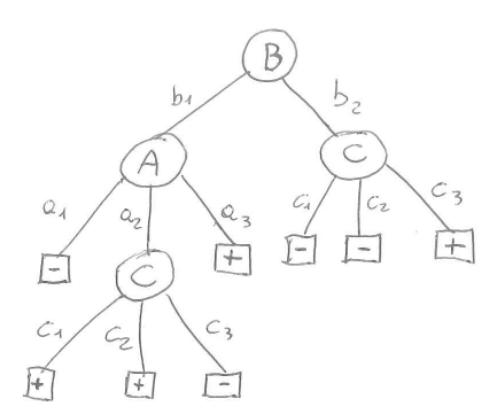

# Machine Learning – December 18, 2023

Last Name First Name Matricola ...................................................... ...................................................... ......................................................

- 1. No books, slides, written notes are allowed during the exam.
- 2. Answers must be explicitly marked with the question they refer to (e.g., 2.1 for question 1 of exercise 2). Cumulative answers which refer to more questions will be evaluated as answering one question only.

Time limit: 1h 45min.

# EXERCISE 1

Given a classification problem for the function f : A × B × C → {+, −}, with A = {a1, a2, a3}, B = {b1, b2}, C = {c1, c2, c3} and the following decision tree T that is the result of a learning algorithm on a given data set:

- 1. Provide a rule based representation of the tree T.
- 2. Provide a formal definition of consistency of an hypothesis with respect to a dataset
- 3. Determine if the tree T is consistent with the following set of samples S ≡ {s1 = ha1, b1, c1, −i, s2 = ha2, b1, c2, +i, s3 = ha1, b2, c3, +i, s4 = ha2, b2, c2, +i}. Show all the passages needed to get to the answer.

#### EXERCISE 2

In Bayesian Learning, given a data set D and a hypothesis h, we can express the following relationship between the probability distributions (Bayes theorem):

$$P(h|D) = \frac{P(D|h)P(h)}{P(D)}$$

In this context:

- 1. define Maximum a posteriori (MAP) hypotheses and Maximum likelihood (ML) hypotheses.
- 2. formally describe the concept of Naive Bayes Classifier
- 3. describe the assumption made in Naive Bayes Classifier and provide a comment about this assumption in terms of practical applicability of the method.

### EXERCISE 3

- 1. Describe the perceptron model for classification and its training rule.
- 2. Draw a graphical representation of a linearly separable 2D data set for binary classification and provide a qualitative graphical example of a possible evolution of perceptron training (4 images showing a possible temporal evolution of the solution of the algorithm on the sketched data set, with the last image showing a possible final solution).

## EXERCISE 4

- 1. Given a data set D, denoted with its design matrix X and its output vector t, formally describe a kernelized linear model and provide the formal definition of the Gram matrix.
- 2. If the target function is f : < 4 → C, with |C| = 3 and D contains 100 samples, provide the dimensions of all the elements of the kernelized linear model.

#### EXERCISE 5

- 1. Describe the role of the following algorithms related to parameter estimation of an artificial neural network:
  - Backpropagation
  - Stochastic Gradient Descent
- 2. Provide the main steps of the Stochastic Gradient Descent algorithm, highlight the hyperparameter(s) of the algorithm and discuss the sensitivity of the solution with respect to the hyperparameters.