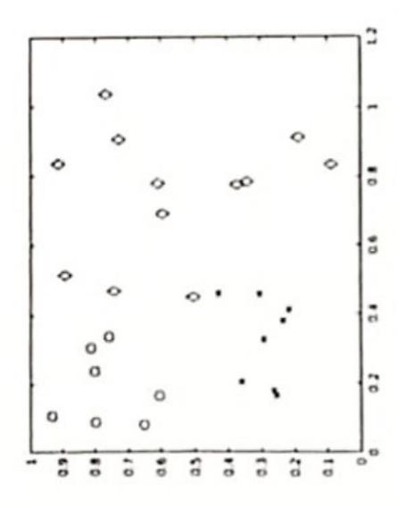

## December 16, 2024 Machine Learning

First Name

Last Name

Matricola

- No books, slides, written notes are allowed during the exam. \_
- Answers must be explicitly marked with the question they refer to (e.g., 2.1 for question 1 of exercise 2). Cumulative answers which refer to more questions will be evaluated as answering one question only.

Time limit: 1h 45min.

## EXERCISE 1

- Provide the definition of Confusion matrix for a binary classification problem, formally explain the content of the matrix.
- classes (e.g., about 90% of samples from the negative class). Show the confusion matrix in two formats: Provide a numerical example of a non-symmetric confusion matrix for an unbalanced dataset with 2 with absolute values and with the corresponding percentage values. (Hint: use simple numerical values, so that you do not need to make complex calculations.) ci
- Compute accuracy, precision and recall according to the numerical example provided above.

## EXERCISE 2

- Classifier and highlight their differences. Explain all the terms of the Formally describe the Bayes Optimal Classifier and the Naive Bayes formulas.
- Consider a classification problem  $f: A_1 \times A_2 \times A_3 \rightarrow \{T, F\}$ , with  $A_1 = \{a, b, c\}, A_2 = \{h, k\}, A_3 = \{u, v, w\}$  and the data set in the table on the right. Use Naive Bayes to predict the output for the input value (a, k, u), showing all the steps needed to provide the answer. ci

| -              | Ŀ | T | H | Ŀ | H | T |
|----------------|---|---|---|---|---|---|
| A 3 | > | × | > | 2 | × | = |
| A2             | п | × | д | * | * | Ч |
| $A_1$          | æ | q | υ | q | B | ပ |

## EXERCISE 3

Consider a 3-classes classification problem and the data shown in the figure on the right and classification based on support vector machines (SVMs):

- Describe a linear model for this problem (3-classes classification)
- Explain if the data in the figure are linearly separable and motivate your answer
- Explain what type of kernel function for SVM you would use for this dataset and provide the formal definition of the kernelized model.

