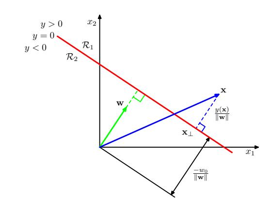
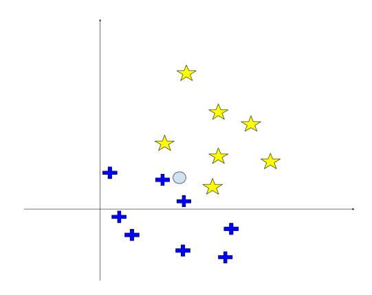

# Machine Learning – September 17, 2025

| Matricola | Last Name | First Name |
|-----------|-----------|------------|

- 1. No books, slides, written notes are allowed during the exam.
- 2. Answers must be explicitly marked with the question they refer to (e.g., 2.1 for question 1 of exercise 2). Cumulative answers which refer to more questions will be evaluated as answering one question only.

Time limit: 2 hours.

## EXERCISE 1

- 1. Discuss the following statement: "Accuracy is not always a good performance metric for classification".
- 2. Provide a numerical example to motivate your answer.

### EXERCISE 2

A robotic device is used to sort two types of objects. Its perception component is a binary classifier with two continuous variables in input f : ℜ 2 → {C1, C2}. Let D be a suitable supervised dataset for this problem.

- 1. Formally describe a probabilistic generative model based on maximum likelihood (e.g., Gaussian Naive Bayes) for such a classification problem, assuming Gaussian distributions.
- 2. Provide invented values for the parameters of the model described above.
- 3. Qualitatively draw the model with invented parameters described above and show two new samples x1, x2, such that x1 is predicted as C1 and x2 is predicted as C2.

## EXERCISE 3

- 1. Describe the maximum margin principle used by Linear SVM classification. Consider the figure on the right where w is the normal vector of a boundary and r = y(x) ∥w∥ the distance of a point x from the boundary. Describe which quantity should be maximized and with respect to which parameter in order to obtain a boundary having the largest margin.
- 2. Draw an example of a 2-D binary linear classification problem showing qualitatively: i) a generic solution, and ii) a maximum margin solution computed by SVM.

## EXERCISE 4

- 1. Describe the K-nearest neighbors (K-NN) algorithm for classification.
- 2. Given the dataset on the right for the two classes {star, plus}, determine the answer of K-NN for the query point indicated with symbol o for K=1, K=3, and K=5. Motivate your answer, showing (with a graphical drawing) which instances contribute to the solution.

## EXERCISE 5

Describe the following algorithms used for training artificial neural networks:

- 1. Backpropagation
- 2. Stochastic Gradient Descent

For each algorithm, clearly define (in a formal way) inputs and outputs and describe the main steps of execution.

#### EXERCISE 6

- 1. Describe the concept of bagging in the definition of an ensemble model. Describe precisely the training procedure for such a model and the final formula used for prediction.
- 2. Discuss the difference between bagging and voting, highlighting in particular the use of different types of models.