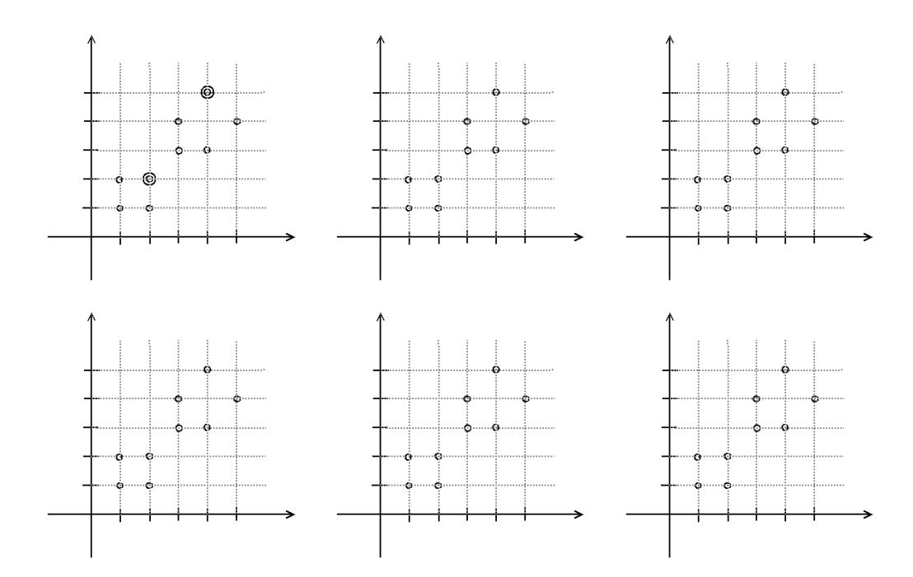

# Machine Learning – Test - December 16, 2019

Time limit: 2 hours.

|                   | Last Name                                                    | First Name                                                                               | Matricola                                 |
|-------------------|--------------------------------------------------------------|------------------------------------------------------------------------------------------|-------------------------------------------|
|                   |                                                              |                                                                                          |                                           |
|                   |                                                              |                                                                                          |                                           |
| Note: student. | academic year (when you were supposed to attend the course). | if you are not doing the regular exam for ML 2019/20, write below name of exam, CFU, and | Please specify also if you are an Erasmus |
|                   |                                                              |                                                                                          |                                           |

# EXERCISE 1

A car driver in Rome has to move from one side of the Tiber river to the other very often every day. There are three possible alternative paths passing to three different bridges and the paths are known. The driver wants to minimize the time to reach the target location, but due to traffic conditions, it is not guaranteed that the shortest path is also the quickest way. Moreover, traffic conditions are unpredictable, fully observable and (quasi-)stationary.

- 1. Describe a complete model for this problem based on MDP, specifying all its elements.
- 2. Describe how to solve the problem based on Reinforcement Learning and determine the exact training rule to use to learn the best behavior.
- 3. Discuss the strategy for balancing exploration and exploitation.

## EXERCISE 2

Describe the Markov property of Markovian models representing dynamic systems. Describe the difference between a Markov Decision Process (MDP) and a Hidden Markov Model (HMM). Draw and explain the graphical models of MDP and HMM.

# EXERCISE 3

Consider a three-layers ANN which receives in input vectors x of dimension 64 and produces output vectors y of dimension 10. The two hidden layers of the ANN are composed of 100 units each and use the ReLU activation function. The output units use a linear activation function. The weight matrices anche the bias terms of the hidden and output layers are denoted, respectively, W1, b1, W2, b2, and W3, b3.

- 1. Provide the dimensions of the weight matrices and bias terms W1, b1, W2, b2, W3, b3
- 2. Compute the number of trainable parameters including the bias terms, motivating the answer (i.e., show how to compute this number)
- 3. Provide the formula explicitly relating the output values y in function of the input vector x, using the weight matrices, the bias terms, and the activation functions described above.

## EXERCISE 4

- 1. Briefly describe what is the architecture of an autoencoder and its purpose.
- 2. Draw an example of autoencoder.

#### EXERCISE 5

Simulate the execution of K-means in this 2-D data set with k=2 and initial centroids indicated by double circles: use one diagram for each step of the algorithm. Describe explicitly how each step is obtained and what is the termination condition of the algorithm. Drawing only the steps is not sufficient.

#### EXERCISE 6

- 1. Describe an ensemble method (at your choice) for combining multiple learners. Describe precisely all the elements of the method and the steps to train the model.
- 2. Assume you have 4 binary classifiers for images with medium-good classification accuracy, describe the application of the method illustrated in the previous point to these 4 classifiers.